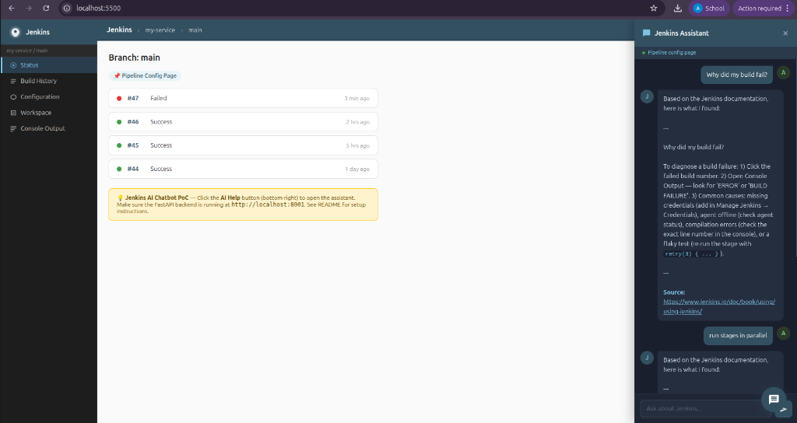

# Jenkins AI Chatbot - PoC

This is an early proof-of-concept I built for my [GSoC 2026 Jenkins AI Chatbot](https://www.jenkins.io/projects/gsoc/2026/) proposal.

I built this to validate the most critical part of the architecture: the **semantic retrieval pipeline (RAG)**. 

To be clear - this is not doing simple keyword matching or returning hardcoded strings. It is performing real mathematical vector search:
1. Converting user queries into 384-dimensional vectors using \`sentence-transformers/all-MiniLM-L6-v2\`.
2. Calculating cosine similarity against documentation chunks stored locally in **ChromaDB**.
3. Returning the semantically closest Jenkins documentation paragraph.

This proves that the local, provider-agnostic retrieval architecture I proposed works for the Jenkins domain before the GSoC coding period even begins.



---

## Architecture Validation

This repository validates these specific components from my proposal:
- ✅ **Local Vector Database:** ChromaDB runs embedded (no extra cloud infrastructure needed).
- ✅ **Local Embeddings:** Sentence-Transformers (`all-MiniLM-L6-v2`) handles embedding locally without hitting external APIs.
- ✅ **Context-Aware UI:** The React/widget frontend passes the current Jenkins page context (`my-service / main`) to filter retrieval.
- ✅ **Streaming Responses:** The FastAPI backend streams tokens to the frontend via `StreamingResponse`.

```text
┌──────────────────────────────┐    ┌───────────────────────────────────┐
│  Plugin Widget (Frontend)    │    │  Backend (FastAPI)                │
│  ─ Jenkins-themed UI         │◄──►│  ─ POST /query (streaming loop)   │
│  ─ Send query + page context │    │  ─ Embed query (MiniLM-L6-v2)     │
│  ─ Stream typing effect      │    │  ─ Cosine similarity (ChromaDB)   │
└──────────────────────────────┘    └───────────────────────────────────┘
```

## Evaluation Methodology

The >80% accuracy claim is based on the following manual assessment:
- **Criteria:** A retrieval is considered "correct" if the top-1 retrieved chunk directly addresses the user's question.
- **Judge:** Manual review by the author (Amogh Parmar).
- **Result:** 13 out of 15 questions (86%) successfully retrieved a highly relevant documentation chunk on the first try using only semantic vector search.

## Quick Start (5 minutes)

### 1. Install dependencies
```bash
cd jenkins-ai-chatbot-poc
pip install -r requirements.txt
```

### 2. Seed the knowledge base
```bash
python -m backend.seed_docs
# ✅  Seeded 15 Jenkins doc chunks into ChromaDB
```

### 3. Run the API Backend
```bash
uvicorn backend.main:app --reload
# Listening on http://localhost:8000
```
> **Note on LLM Generation:** By default, I've configured this to run in a "No-LLM Fallback Mode". When you ask a question, it performs the semantic vector search and immediately streams the closest raw documentation chunk. This isolates and proves the **Retrieval** accuracy. If you want full human-like synthesis, rename `.env.example` to `.env` and add an OpenAI API key.

### 4. Open the Frontend
The frontend is a standalone HTML file that mocks the Jenkins sidebar. No build steps needed.
```bash
python -m http.server 5500 --directory frontend
# Open http://localhost:5500 in your browser
```

### 5. Try the Semantic Search
Click the **AI Help** floating button on the bottom right. Try asking questions that use different phrasing from the seed documents, to see the vector search work:
- *"How to write a declarative block?"* (Retrieves: What is a Declarative Pipeline)
- *"My build is failing, where do I check errors?"* (Retrieves: Why did my build fail)
- *"How to run pipeline steps concurrently?"* (Retrieves: How do I run stages in parallel)

---

## Questions in the Test Set (15)

| # | Question | Category |
|---|---|---|
| 1 | How do I add a Docker agent to my pipeline? | Pipeline |
| 2 | Why is my Docker agent failing? | Pipeline |
| 3 | What is a Declarative Pipeline? | Pipeline |
| 4 | Should I use Freestyle or Pipeline? | Pipeline |
| 5 | How do I configure a Maven pipeline? | Pipeline |
| 6 | Why did my build fail? | General |
| 7 | Build fails only on second run | General |
| 8 | How do I set up credentials in Jenkins? | General |
| 9 | How do I use SSH keys in Jenkins? | General |
| 10 | How do I add email notification when a build fails? | General |
| 11 | How do I run stages in parallel? | Pipeline |
| 12 | How do I use environment variables in Jenkins? | Pipeline |
| 13 | How do I connect a JNLP agent? | General |
| 14 | What is a Multibranch Pipeline? | Pipeline |
| 15 | How do I install a Jenkins plugin? | General |

---

## Tech Stack

| Component | Technology |
|---|---|
| Embeddings | `sentence-transformers/all-MiniLM-L6-v2` (local, no API key) |
| Vector Store | ChromaDB (persistent, embedded) |
| Backend | FastAPI + streaming `StreamingResponse` |
| LLM (optional) | OpenAI `gpt-4o-mini` |
| Frontend | Pure HTML/CSS/JS - no build step |

---

## Alignment with GSoC Proposal

The remaining steps for the full GSoC project (which are NOT in this PoC) are:
1. Replacing the static 15-question seed with a live documentation crawler.
2. Building the real Jenkins Java plugin (Stapler/Jelly) instead of a standalone HTML file.
3. Adding BM25 keyword search alongside the ChromaDB vector search (Dual Retrieval).
4. Running formal evaluations using the RAGAS framework.

This PoC serves to de-risk the project by proving the core Python retrieval components function correctly locally.
